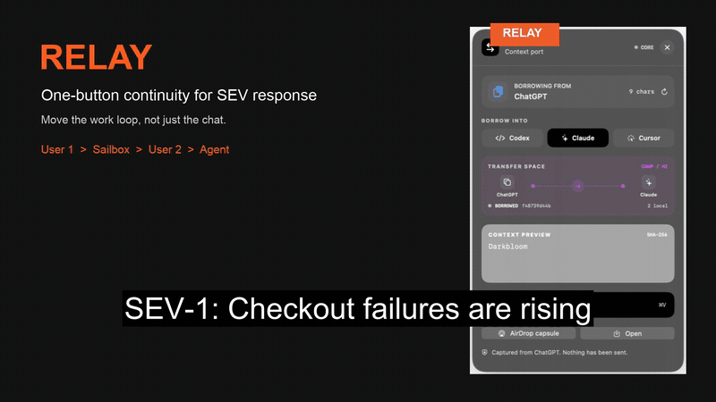

# Relay

**Move the work loop, not just the transcript.**

[](https://www.loom.com/share/908095a693e44b4db042c9ea254a9d9a)

*A compressed, silent preview of the full [Relay investigation demo](https://www.loom.com/share/908095a693e44b4db042c9ea254a9d9a).*

Many production bugs are not isolated coding tasks. They depend on tribal knowledge spread across teams, tools, and prior decisions, and the hardest cases can take one to three days to resolve. Coding agents make an individual developer faster, but today each agent usually works inside one person's environment with its own context, filesystem, and understanding of the task. That makes genuine parallel human-agent collaboration difficult.

Relay makes the human-agent work loop portable. A developer can package the verified objective, evidence, decisions, constraints, failed approaches, and next safe action into a bounded handoff, optionally attach a persistent work environment, and pass control to another developer or a standalone agent. The recipient resumes at the investigation frontier without replaying the whole chat or reconstructing the team's tribal knowledge.

The initial wedge is shift changes and cross-team ownership transfers during production incidents. Greptile can supply code intelligence; Relay preserves the operational work required to act on it.

Relay is a small, vendor-neutral continuation protocol. It sends a verified checkpoint and an acceptance receipt instead of treating a chat transcript as executable state.

The current release is a local or trusted-network prototype. It has no user accounts. Every relay gets a random 256-bit capability URL, expires after 72 hours by default, and is stored as a private local JSON file. Put it behind an authenticated gateway before exposing it to the public internet.

## What works

- Persistent capability-scoped sessions with PM/SWE presence, synchronized briefs, and a common agent activity stream.
- Browser-local recent-session switching, one-click PM invitations, and 72-hour capability expiry.
- Goal-first workspace discovery from the host's Greptile-indexed pull requests, plus an explicit host-only action to create a new private GitHub repository.
- Session-specific Greptile timelines that distinguish closed, remaining, and unknown findings without crediting disappearance as resolution.
- Claude-Mem adapter for retrieving cited session observations before Relay seals the transferable subset.
- Serialized model-run queue shared by HTTP, CLI, JavaScript, OpenCode, and Google A2A entry points.
- One-button web-app overlay with a copyable browser handoff link.
- HTTP API that any harness can call.
- Dependency-free JavaScript client in `src/client.mjs` for direct harness integration.
- CLI for create, fetch, render, accept, and cost estimation.
- Resume renderers for Codex, Claude Code, Cursor, generic agents, and humans.
- Canonical capsule digest and integrity verification.
- Secret-pattern rejection before a capsule is stored.
- Recipient acceptance receipts that bind to the observed digest.
- Expiring capability links with no list or search endpoint.
- Transparent cost sensitivity model and resume-evaluation scaffold.
- Real Sailbox provider that writes the CAMP bundle, pauses while waiting, resumes on pull, and terminates on request.
- Backend-configured autonomous harness runner for no-human continuation.

This is not a full environment checkpoint. It transfers CAMP and handoff context, not repository or filesystem state. Repository snapshots, sandbox images, delegated service capabilities, SSO, revocation, and trace-store connectors remain production work.

## What the demo proves

Open `http://127.0.0.1:4317/demo/greptile` after starting Relay Core.

- Ajinkya describes the work. Relay ranks the host's Greptile-indexed pull requests, or explicitly creates a new private GitHub repository when the work is greenfield.
- Sanjana follows that link. Changes to the product brief appear in both browsers without refreshing.
- Each browser remembers only the sessions whose capability links it has opened. The server exposes no global session list.
- Both collaborators observe the same agent activity stream and exact retained agent responses, while agent runs remain serialized and auditable.
- The main workspace shows Greptile findings addressed and remaining. Relay attributes the fixes to the human-agent loop, not Greptile.
- A structured code-review finding and the human-agent investigation become typed operational memory.
- Relay seals that memory with a SHA-256 digest in a local pod or real Sailbox.
- User 2 restores the same memory set and issues an acceptance receipt bound to that digest.
- The UI labels fixture input, local pods, and real Sailboxes distinctly.

The live session provides concurrent human co-editing around one shared agent workspace. Model execution is serialized through the host's single queue. Relay does not claim simultaneous model execution. The demo also does not claim that Greptile is live unless the authenticated MCP adapter supplied the finding, or claim token and resolution-time savings without the controlled evaluation described below.

## One repository

Relay now ships as one monorepo. The service, browser IDE, CLI, native macOS button, Sail provider, Greptile adapter, A2A surface, and ARC-AGI-3 compatibility harness are versioned together.

```text
relay/
├── src/            Relay service and integrations
├── public/         Browser IDE and one-button UI
├── apps/macos/     Native Relay button
├── bin/            Relay CLI
└── arc-agi-3/      Resumable long-horizon agent harness
```

The ARC compatibility demonstration proves checkpoint and resume behavior across processes. It is not an official ARC-AGI-3 leaderboard score.

### Live Greptile MCP

Relay connects to Greptile through the official MCP server rather than an invented REST endpoint. Configure `GREPTILE_API_KEY` on the backend and use:

```text
GET  /v1/integrations/greptile/status
GET  /v1/integrations/greptile/pull-requests?limit=10
POST /v1/integrations/greptile/comments
POST /v1/integrations/greptile/improve
```

The comments request accepts `name`, `prNumber`, `remote`, and `defaultBranch`. Session sync retrieves both open and addressed Greptile-generated comments. Relay counts a finding as closed only when an ID first observed open later appears addressed. A missing ID becomes unknown. The browser never receives the API key.

The improvement endpoint implements a bounded review loop for any active engineering investigation:

```text
Greptile review -> Relay handoff -> human or agent patch -> Greptile re-review
```

It stops when no unresolved Greptile comments remain or after a frozen maximum of five iterations. `triggerReview: true` explicitly asks Greptile to review; omitting it performs a read-only check and creates a verified Relay handoff only when action is required. Relay records the iteration budget and stop condition inside the handoff so an autonomous harness cannot recurse silently.

### Shared-session API

Session capabilities are returned once and kept in URL fragments plus each collaborator's browser-local recent list. Tokens are SHA-256 hashed in atomic `0600` records and are never returned by a server listing endpoint.

```text
POST /v1/sessions
GET  /v1/sessions/:id
POST /v1/sessions/:id/join
POST /v1/sessions/:id/brief
GET  /v1/sessions/:id/events
POST /v1/sessions/:id/greptile/sync
GET  /v1/sessions/:id/metrics
POST /v1/sessions/:id/checkpoints
POST /v1/sessions/:id/agent/run
```

Regular calls use `Authorization: Bearer <capability>`. The SSE endpoint also accepts `?token=` because the browser `EventSource` API cannot set authorization headers. Relay does not log request URLs.

### Claude-Mem bridge

Claude-Mem captures and retrieves memory inside the active coding session. Relay queries its local worker, preserves observation IDs as provenance, and transfers only the selected context across collaborators and harnesses.

```text
GET  /v1/integrations/claude-mem/status
POST /v1/integrations/claude-mem/search
```

The integration uses the existing Claude-Mem worker and Claude Code OAuth session. Relay never receives the OAuth token. A successful connection with zero observations is shown honestly as an empty project memory, not as imported context.

See [`ARCHITECTURE.md`](./ARCHITECTURE.md) for the stack, integration boundary, and Sailbox path.

## Run it

Requires Node.js 20 or newer.

### Host

```bash
brew install thehimalayanleo/relay/relay && relay configure && relay serve --host 0.0.0.0 --public-url http://<tailscale-name>:4317
```

Create and print a shared session from the host terminal:

```bash
relay session create --title "Fix checkout retries" --repo OWNER/REPO --pr 42
```

`--public-url` controls the collaborator-facing invitation. It should be the trusted LAN or Tailscale address that reaches the host. Relay still prints a separate localhost workspace for the host. When binding to `0.0.0.0` without `--public-url`, Relay warns instead of silently advertising localhost to collaborators.

### Collaborator

Open the invite link. No installation or keys required.

Sanjana does not need Homebrew, Relay, Sail, Greptile, Claude-Mem, GitHub, or a model-provider credential. Her browser carries one expiring capability for one session. Every integration request and model job executes on Ajinkya's host.

The public tap lives at [thehimalayanleo/homebrew-relay](https://github.com/thehimalayanleo/homebrew-relay). No GitHub login or repository token is required for the host installation.

Run `relay configure` once on the host. It prompts silently for Sail and Greptile keys and saves them locally with mode `0600`. Claude-Mem is detected from the host worker. Model execution uses the host-approved `RELAY_AGENT_ARGV` command and its host-side provider credentials. None of these values are returned to browsers.

Two collaborators must point at the same Relay server. Two independent localhost servers do not share a session.

Relay is designed for trusted LAN or Tailscale use at this stage. Capability links are bearer authority. Do not expose the service directly to the public internet without an authenticated gateway and TLS.

```bash
cd relay
npm test
npm start
```

Open `http://127.0.0.1:4317`.

### Connect a real Sailbox

Create an API key in the [Sail dashboard](https://app.sailresearch.com). Keep it out of the browser, capsule, repository, and chat. On macOS, store it in Keychain:

```bash
read -s SAIL_KEY
security add-generic-password -U -a "$USER" -s relay-sail-api-key -w "$SAIL_KEY"
unset SAIL_KEY
```

Start Relay with the key injected only into the backend process:

```bash
SAIL_API_KEY="$(security find-generic-password -a "$USER" -s relay-sail-api-key -w)" npm run start:sail
node bin/relay.mjs doctor
```

The health response should report `"provider": "sail"`. Creating a handoff with `--pod` now creates a private Sailbox, writes the three context files under `/opt/relay/handoffs/<id>`, and pauses the VM. Pulling the handoff resumes it.

The native floating button lives in [`apps/macos`](./apps/macos). It captures an explicit clipboard selection, renders it for Codex, Claude, or Cursor, and can ask Relay Core to create the same capability link and work pod.

Create a relay from another harness:

```bash
node bin/relay.mjs create examples/capsule.json
```

The response contains a capability `shareUrl`. Paste it into an approved channel or pass it directly to another harness. The recipient only needs a browser.

## Agent CLI

The CLI is designed as the orchestration surface for agents and shell workflows. Structured commands emit JSON to stdout, errors use stderr and a nonzero exit code, and `--quiet` emits only the capability URL.

```bash
# Confirm that Relay Core is reachable
node bin/relay.mjs doctor

# Turn notes or another command's output into a one-button equivalent
git diff | node bin/relay.mjs handoff - \
  --goal "Finish the parser repair" \
  --next "Run npm test and inspect failures" \
  --to codex \
  --pod \
  --quiet

# Pull the verified record, destination prompt, and work pod in one JSON response
node bin/relay.mjs pull '<share-url>' --target claude
```

Run `node bin/relay.mjs --help` for the lower-level `create`, `get`, `pod`, `render`, `accept`, and `cost` verbs.

Terminate the remote work pod when the work is finished:

```bash
node bin/relay.mjs terminate '<share-url>'
```

Render the same checkpoint for a receiving harness:

```bash
node bin/relay.mjs render '<share-url>' --target codex
node bin/relay.mjs render '<share-url>' --target claude
node bin/relay.mjs render '<share-url>' --target cursor
```

Accept responsibility and issue a receipt:

```bash
node bin/relay.mjs accept '<share-url>' \
  --actor agent-2 \
  --harness codex \
  --goal 'Fix the parser regression without changing the public API.' \
  --first-action 'Verify the workspace digest and run the targeted test.'
```

## Embed one button in any harness UI

Serve `public/relay-button.js`, place the capsule JSON in a script element, then add:

```html
<script type="module" src="https://your-relay-host/relay-button.js"></script>
<script id="current-checkpoint" type="application/json">{"title":"..."}</script>
<relay-button
  endpoint="https://your-relay-host"
  source="#current-checkpoint"
  source-app="Your agent"
  default-target="claude">
</relay-button>
```

The component renders a 54-pixel floating port over the host web app. Selecting it adds a light backdrop and a compact transfer space. One action seals the checkpoint and copies the capability link. It does not open a platform share sheet and does not require a handoff form.

## Work pods and Sailboxes

Every session checkpoint can attach a work pod. Both the local fallback and Sail provider write four sealed files:

- `CAMP.json` for machine-readable state and lineage.
- `HANDOFF.md` for a fresh agent or person.
- `manifest.json` for lifecycle and provider metadata.
- `SESSION.json` for the exact brief version, Claude-Mem observation IDs, Greptile provenance and metrics, activity summary, and checkpoint references.

The receiver uses the same capability link to pull that pod context. This makes the demonstration `User 1 → Work Pod → User 2`, instead of pretending that a chat summary is a complete environment.

`src/workpods.mjs` is the provider boundary. `SailWorkPodProvider` creates a private persistent VM, writes the CAMP bundle through Sail's filesystem API, pauses it while the handoff waits, resumes it for the recipient, stores autonomous-agent results, and terminates it explicitly. `LocalWorkPodProvider` remains the account-free fallback. Sail credentials stay on the backend and never enter the browser capsule.

The local pod is not a remote CPU and cannot be reached from another laptop unless this service is deployed on a reachable trusted host. The Sail provider is remote compute, but the Relay API itself still needs to be reachable by both users.

## Autonomous continuation and a 5090 model

Relay can hand the sealed resume prompt to one operator-configured command. The capability holder chooses only the renderer, never the command. Configure the command as a JSON argv array:

```bash
export RELAY_AGENT_HARNESS="deepseek-5090"
export RELAY_AGENT_ARGV='["ssh","5090","python3","/home/ajinkya/relay_agent.py"]'
npm run start:sail
```

The harness receives the resume prompt on stdin and must write its result to stdout. This contract also works with a local model server, OpenCode, or another agent harness. Trigger it with:

```bash
node bin/relay.mjs agent '<share-url>' --target generic
```

The result is written back into the same work pod as `agents/<run-id>.json`. This is the first no-human loop. A production scheduler, cancellation API, model endpoint policy, and multi-step supervision remain future work.

### Canonical E2E: two SWEs build the AGI-ARC-3 harness

The host can configure OpenCode Go as Relay's serialized runner:

```bash
export RELAY_AGENT_HARNESS=opencode-go-gpt-5.6-luna
export RELAY_OPENCODE_MODEL=opencode-go/gpt-5.6-luna
export RELAY_AGENT_ARGV='["relay-opencode-runner"]'
relay serve --host 0.0.0.0 --public-url http://<tailscale-name>:4317
```

Ajinkya starts the AGI-ARC-3 harness from his local Relay app. Sanjana joins as a second SWE through the capability link, adds a concrete fresh-reset replay constraint, and hands the shared state back. Ajinkya's local agent continues from the same Sailbox with Sanjana's wording present in its inherited context. Relay retains the exact response and queue evidence.

From a source checkout, the reproducible proof is:

```bash
npm run e2e:arc-collaboration
```

The test fails unless Sanjana's exact feedback appears in the sealed session, the continuing agent inherits it, the response is retained, and the agent artifact uses the same Sailbox. Model execution remains serialized. This is not simultaneous model execution.

The stricter builder/challenger contract test runs two independent OpenCode sessions against one Sailbox and refuses to promote the benchmark score when the sealed `savepoint-demo` artifacts are absent:

```bash
SAVEPOINT_REPO=/path/to/savepoint-demo npm run e2e:arc-builder-challenger
```

It preserves the primary-builder and independent-challenger prompts, checks distinct OpenCode session IDs, proves serialized execution, and reports `blocked_missing_repository` instead of fabricating the 12/183 baseline.

Node-based harnesses can use the client directly:

```js
import { RelayClient } from "./src/client.mjs";

const relay = new RelayClient("http://127.0.0.1:4317");
const transfer = await relay.create(currentCheckpoint, { workPod: true });
const codexPrompt = await relay.render(transfer.shareUrl, "codex");
const resumed = await relay.pull(transfer.shareUrl, "codex");
```

The transport schema is published at `schema/relay-v1.schema.json` so non-JavaScript harnesses can implement the same contract.

## Minimal API

| Method | Route | Purpose |
| --- | --- | --- |
| `POST` | `/v1/relays` | Normalize, scan, seal, and store a capsule |
| `GET` | `/v1/relays/:id` | Fetch and integrity-check a capsule |
| `GET` | `/v1/relays/:id/render?target=codex` | Produce a harness-specific resume prompt |
| `GET` | `/v1/relays/:id/pod` | Pull the sealed work-pod context bundle |
| `POST` | `/v1/relays/:id/agent/run` | Run the backend-configured autonomous harness |
| `GET` | `/v1/relays/:id/agent/queue` | Inspect active, waiting, and completed serialized model runs |
| `POST` | `/v1/relays/:id/pod/terminate` | Permanently terminate the attached work pod |
| `POST` | `/v1/relays/:id/accept` | Record the recipient's understanding and first action |
| `POST` | `/v1/cost-estimate` | Run the configurable unit-economics model |

Use `Authorization: Bearer <capability-token>` for recipient API calls. The receiver link carries the token in its URL fragment, so browsers do not send the capability to the server as part of the page request.

## Cost efficacy

Run:

```bash
npm run cost
```

The output deliberately separates two value sources:

1. Input-token savings from loading a compact capsule rather than a full trace.
2. Avoided recovery work when fewer resumes fail or repeat completed work.

The included scenarios are assumptions, not product results. They show that token savings alone are usually a weak business case. The product becomes economical only if measured resume fidelity reduces repeated human and agent work.

Planning-level build ranges, not vendor quotes:

- Protocol prototype: 1 to 2 engineer-weeks, roughly $5k to $20k loaded cost.
- Team pilot with two real harness integrations and evaluation: 6 to 10 engineer-weeks, roughly $50k to $150k.
- Production service with SSO, policy, revocation, encrypted artifact storage, audit, and reliability work: 3 to 6 engineer-months, roughly $150k to $500k.

To replace assumptions with evidence, run interrupted tasks under four conditions: fresh start, raw transcript, naive summary, and Relay. Record task success, time to first correct action, input tokens, repeated actions, false inherited claims, and duplicate side effects. Put the observations in the format of `examples/eval-results.example.json`, then run:

```bash
node scripts/evaluate.mjs path/to/measured-results.json
```

Do not present the included example rows as empirical results.

## Production boundary

Before public or company-wide deployment, add:

- SSO and team authorization.
- Revocation and short-lived delegated capabilities.
- Encryption at rest and managed retention.
- Repository, sandbox, and trace-store connectors.
- Policy-aware redaction and a stronger secret scanner.
- Immutable audit logging.
- Rate limiting and abuse controls.
- A measured cross-model resume benchmark.

Relay should remain the continuation protocol. Harness-specific skills and plugins should be thin adapters, never the source of truth.
